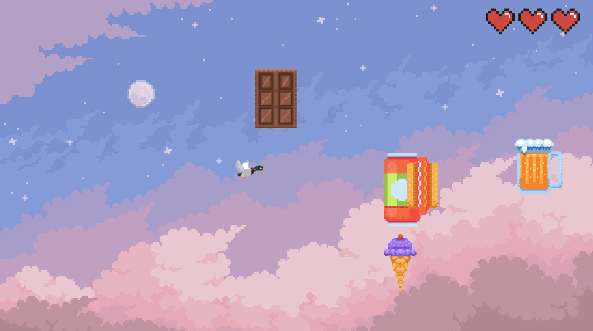

# Flying Duck
A web browser game created for Computer Games Programming and Design college course.

* [Description](#description)
  * [Disclaimer](#disclaimer)
  * [How to play](#how-to-play)
* [Screenshots](#screenshots)

## Description
The game is a simple 2D platformer where the player controls a duck that can fly. The goal is to avoid flying obstacles without losing all lives. The game is written in JavaScript using the Phaser 3 framework [^1]. The longer the player survives, the harder the game gets.

### Disclaimer
Every asset used in this project was listed on the Internet as free to use and modify. If you find any asset that might have been mislabeled and is not, in fact, free to use, please contact me. The game is not meant to be published, as it is just a college project.

### How to play
Start the game by opening the `index.html` file in your browser. Visual Studio Code and Live Server plugin recommended. The game will start after pressing the Enter key, as displayed in the menu screen. Use the arrow keys to move the duck and avoid obstacles. The game ends when the player loses all lives. Survive!

## Screenshots

[^1]: [Phaser 3 GitHub page](https://github.com/photonstorm/phaser)